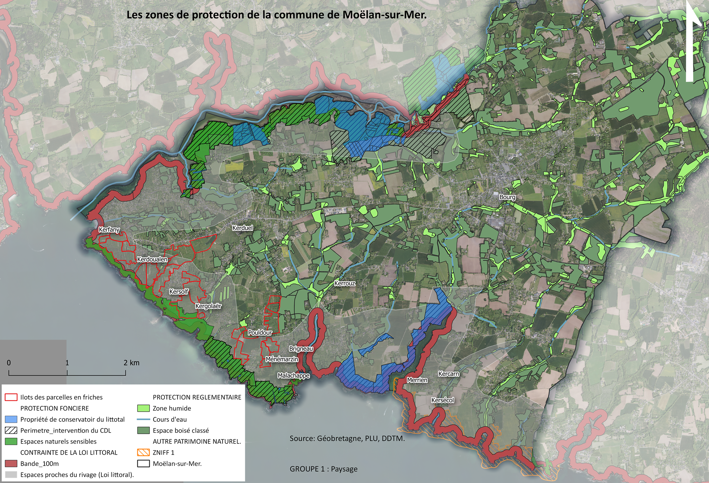
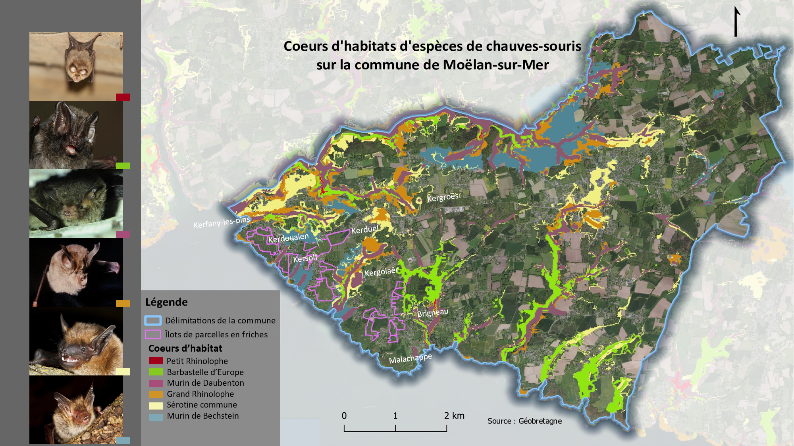
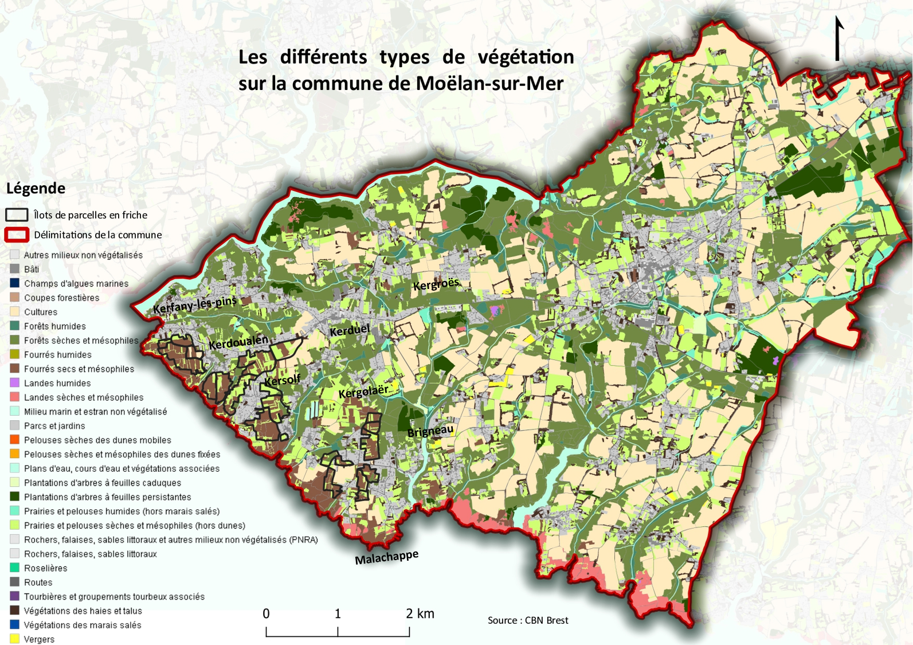
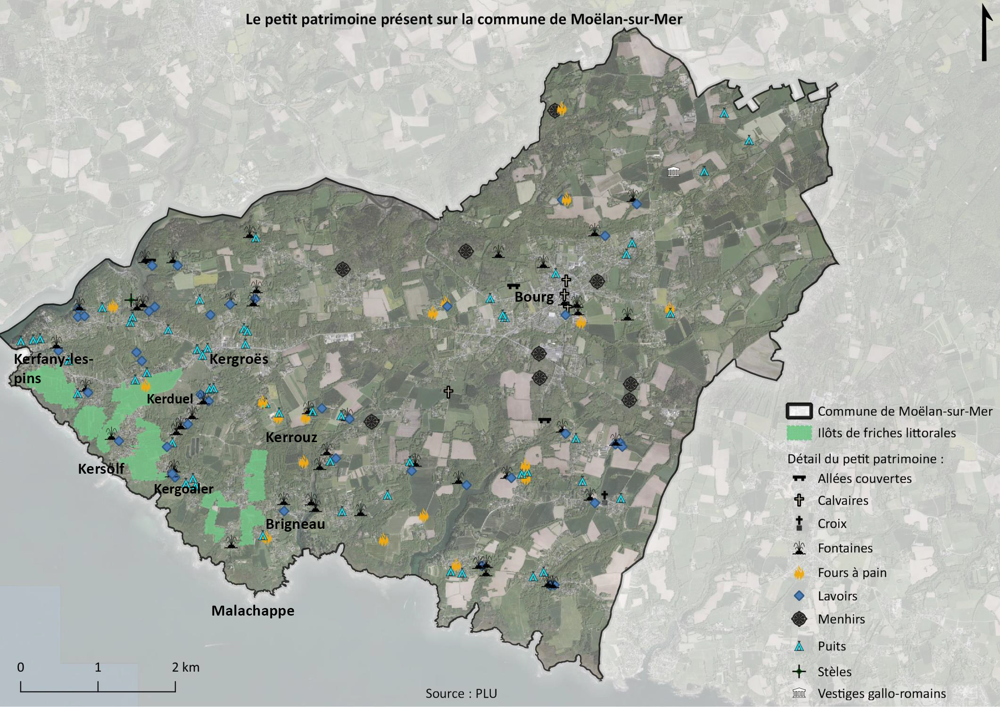
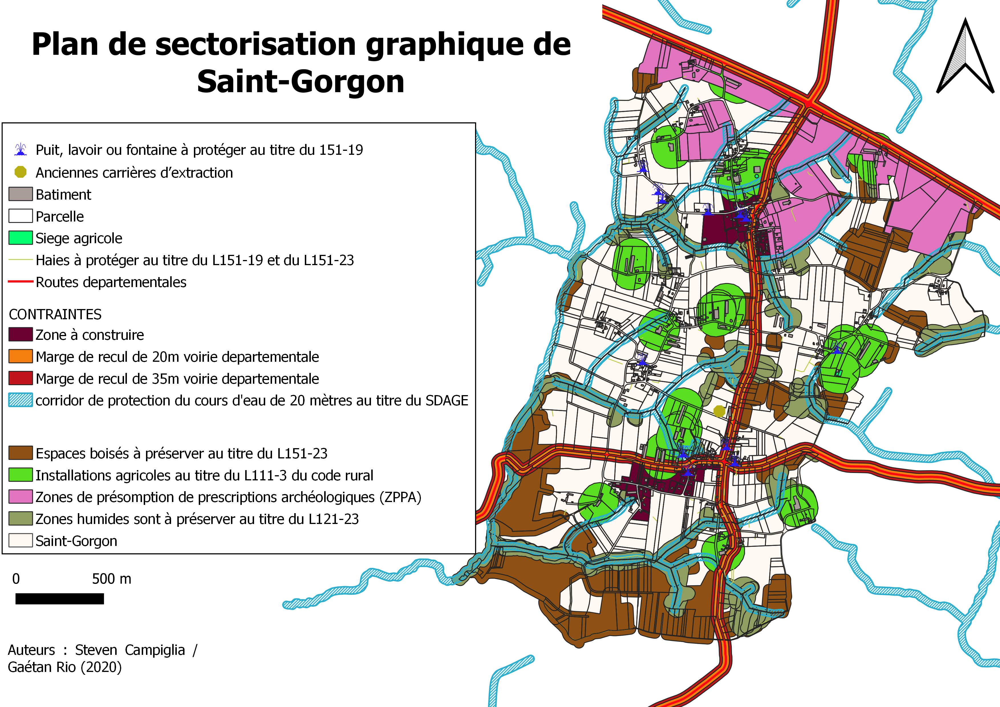

# Portfolio SIG — Gaétan Rio

**Géomaticien · Aménagement du territoire · Environnement**

SIG avec une double compétence en aménagement territorial et géomatique appliquée. 
Master AUTELI (Université Bretagne Sud) + 4 ans d'expérience en collectivité territoriale (Quimperlé Communauté).  
En cours de spécialisation technique : PostGIS · Python SIG.

📍 Rennes, Bretagne — 📧 rg_gaetan@yahoo.fr

---

## Compétences techniques

| Domaine | Outils |
|---|---|
| SIG | QGIS · Géobretagne · BD TOPO IGN · WFS/WMS |
| Données | Données ouvertes (data.gouv.fr, INSEE, INPN) · PLU · DDTM |
| Analyse spatiale | Analyse multicritères · Scoring · Cartographie thématique |
| Environnement | ZNIEFF · Natura 2000 · Loi Littoral · TVB · Chiroptères |
| Mobilité | Schéma directeur cyclable · Données linéaires · Itinéraires |
| Urbanisme | PLU · Sectorisation · Contraintes réglementaires |
| En cours | PostGIS · Python (GeoPandas, NetworkX) · Format RAEPA |

---

## Réalisations

---

### 1 — Analyse multicritères pour l'implantation d'un Parc Naturel Régional en Bretagne

> Projet universitaire — Master AUTELI, Université Bretagne Sud

**Problématique :** Identifier les zones les plus propices à l'implantation d'un nouveau PNR en Bretagne en croisant critères environnementaux et sociaux.

**Méthode :** Carroyage 5×5 km sur l'ensemble de la région · Scoring multicritères pondéré · Croisement de 8 couches de données spatiales via flux WFS (Géobretagne, INPN, INSEE).

**Données mobilisées :** ZNIEFF type 1 & 2 · Zones Natura 2000 · ZPS/ZICO · Cours d'eau TVB · Sites chiroptères · Densité de population · Sites classés et inscrits.

**Résultat :** Identification d'une zone candidate de 100 km² sur le littoral ouest breton (secteur Plovan), répondant à l'ensemble des critères environnementaux retenus.

**Outils :** QGIS · WFS Géobretagne · INPN · INSEE

---

### 2 — Diagnostic environnemental et paysager de Moëlan-sur-Mer

> Projet universitaire — Master AUTELI, Université Bretagne Sud  
> Territoire : commune de Moëlan-sur-Mer (Finistère Sud, littoral breton)

Série de cartes thématiques réalisées dans le cadre d'un diagnostic territorial complet, appliquant la réglementation littoral et les outils de protection environnementale.

#### 2a — Zones de protection réglementaire
Cartographie croisée des protections foncières (Conservatoire du Littoral, ENS), réglementaires (Loi Littoral, zones humides, espaces boisés classés) et patrimoniales (ZNIFF 1).  
**Sources :** Géobretagne · PLU · DDTM

#### 2b — Analyse topographique et hydrologique
Analyse des pentes (MNT IGN), courbes de niveau et réseau hydrographique — croisement avec les îlots de friches littorales à revaloriser.  
**Sources :** IGN

#### 2c — Coeurs d'habitats de chauves-souris
Cartographie des corridors et coeurs d'habitat de 6 espèces de chiroptères (Barbastelle d'Europe, Grand Rhinolophe, Murin de Daubenton...) sur fond orthoimage.  
**Sources :** Géobretagne

#### 2d — Types de végétation
Cartographie fine des formations végétales (25+ types) : forêts humides, landes, roselières, végétations marines, dunes — données CBN Brest.  
**Sources :** CBN Brest

#### 2e — Petit patrimoine
Inventaire et cartographie de l'ensemble du petit patrimoine communal : menhirs, calvaires, fontaines, fours à pain, puits, lavoirs, vestiges gallo-romains.  
**Sources :** PLU Moëlan-sur-Mer

#### 2f — Carte des enjeux du diagnostic paysager
Synthèse cartographique multicouche croisant protections, petit patrimoine, hydrographie et îlots sélectionnés pour intervention.  
**Sources :** IGN · PLU

---

### 3 — Schéma Directeur Cyclable — Révision 2022, Quimperlé Communauté

> Réalisation professionnelle — Agent Territorial, Quimperlé Communauté (Pôle Aménagement / Service Déplacements)

**Contexte :** Révision du schéma directeur cyclable intercommunal, présenté au Bureau Communautaire en mai 2022, transmis en préfecture.

**Contenu :** Cartographie des itinéraires intercommunaux (12 itinéraires, 7 496 k€ HT) et des liaisons locales (16 itinéraires, 1 922 k€ HT) · Hiérarchisation par niveau d'intérêt communautaire · Définition du fonds de concours adapté.

**Dimension SIG :** Structuration et mise à jour des couches géographiques linéaires cyclables · Cartographie de présentation aux élus · Intégration données IGN 2022.

**Outils :** QGIS · BD TOPO IGN · Données intercommunales

> *Document délibéré et transmis en préfecture — réalisation opérationnelle en collectivité.*

---

### 4 — Plan de sectorisation graphique PLU — Saint-Gorgon

> Projet universitaire — Master AUTELI, Université Bretagne Sud  
> Réalisation : Gaétan Rio & Steven Campiglia (2020)

Cartographie réglementaire PLU : sectorisation graphique complète intégrant les contraintes agricoles (L111-3, L151-19, L151-23), corridors SDAGE, zones de recul voirie, ZPPA, zones humides et espaces boisés.

**Outils :** QGIS · Données cadastrales · PLU · SDAGE

---

## Formation & parcours

- **Master GAED** — Aménagement et Urbanisme des Territoires Littoraux, Université Bretagne Sud
- **Stagiaire chargé d'urbanisme opérationnel** — SAS Le Biahn & Associés, cabinet Géomètre-expert (2021)
- **Agent Territorial** — Quimperlé Communauté, Pôle Aménagement / Service Déplacements (2021–2025)
- **TOEIC 960/990** · Cambridge First Certificate

---

*Portfolio en cours d'enrichissement*
